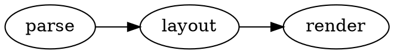
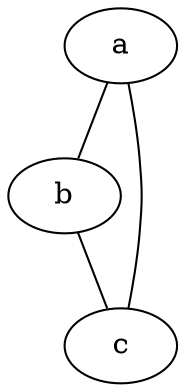
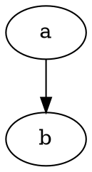

# @knowvah/vitepress-plugin-dot

Render [Graphviz](https://graphviz.org/) **DOT** fenced code blocks to inline SVG
in [VitePress](https://vitepress.dev/) — **at build time**, with no client-side
JavaScript — powered by the pure-TypeScript [`graphviz-ts`](https://www.npmjs.com/package/graphviz-ts)
engine.

Unlike client-rendered diagram plugins (e.g. mermaid, which ships a WASM/JS
runtime and renders in the browser on mount), `graphviz-ts` is **synchronous and
runs in Node**, so this plugin renders each diagram during `vitepress build` and
embeds static `<svg>` directly in the HTML:

- **No client JS** for diagrams, no hydration, no flash of unrendered code.
- **Works on any static host**, in email, in offline docs.
- **Fails gracefully** — a bad graph becomes a readable error panel, not a broken build.

````md

````

## Install

```bash
npm i -D @knowvah/vitepress-plugin-dot graphviz-ts
```

`graphviz-ts` is a peer dependency — you install the engine version you want.

## Usage

Wrap your VitePress config and import the stylesheet in your theme:

```ts
// docs/.vitepress/config.ts
import { defineConfig } from 'vitepress';
import { withDot } from '@knowvah/vitepress-plugin-dot';

export default withDot(
  defineConfig({
    title: 'My Docs',
  }),
  {
    // options (all optional)
    defaultEngine: 'dot',
    useCurrentColor: true, // inherit theme text color (nice in dark mode)
  },
);
```

```ts
// docs/.vitepress/theme/index.ts
import DefaultTheme from 'vitepress/theme';
import '@knowvah/vitepress-plugin-dot/style.css';

export default DefaultTheme;
```

That's it. Now ` ```dot ` blocks render.

### Per-block engine

Per-block options go in the fence info, **space-separated** — not in `{...}`
(VitePress reserves curly braces in fence info for line highlighting and strips
them before the plugin sees them):

````md

````

### Client-side render mode

By default diagrams render at build time (static SVG). Set `mode: 'client'`
globally, or add `client` to a single block, to render in the browser on mount
instead — useful for untrusted or interactive graphs. Add `build` to a block to
force build-time rendering when the global default is `client`.

````md

````

Client mode requires registering the `DotDiagram` component in your theme:

```ts
// docs/.vitepress/theme/index.ts
import DefaultTheme from 'vitepress/theme';
import { DotDiagram } from '@knowvah/vitepress-plugin-dot/client';

export default {
  extends: DefaultTheme,
  enhanceApp({ app }) {
    app.component('DotDiagram', DotDiagram);
  },
};
```

Trade-offs: build mode ships zero JS and renders instantly; client mode ships the
graphviz-ts engine to the browser (lazy-loaded on first diagram) and shows a brief
mount delay, but keeps a pathological graph off your build and re-renders nothing
on navigation. Both honor `useCurrentColor` for dark mode.

### Opt a block out (keep it as highlighted source)

````md

````

### Compose with other markdown plugins

`withDot` preserves any existing `markdown.config` hook, so it composes with
plugins like [`vitepress-plugin-mermaid`](https://www.npmjs.com/package/vitepress-plugin-mermaid):

```ts
export default withDot(withMermaid(defineConfig({ /* ... */ })));
```

You can also skip the wrapper and register the markdown-it plugin directly:

```ts
import { dotMarkdown } from '@knowvah/vitepress-plugin-dot/markdown-it';

export default defineConfig({
  markdown: {
    config: (md) => dotMarkdown(md, { defaultEngine: 'dot' }),
  },
});
```

## Options

| Option            | Type                   | Default      | Description                                                                                     |
| ----------------- | ---------------------- | ------------ | ----------------------------------------------------------------------------------------------- |
| `renderLanguage`  | `string`               | `"dot"`      | The fence info-string that triggers rendering. Set to `"graphviz"` to leave ` ```dot ` as source. |
| `mode`            | `'build' \| 'client'`  | `"build"`    | Render at build time (inline SVG) or in the browser. Per-block: add `client` or `build` to the fence. |
| `defaultEngine`   | `EngineName`           | `"dot"`      | Layout engine when a block doesn't specify one. Per-block: ` ```dot engine=neato `.             |
| `wrapperClass`    | `string`               | `"dot-diagram"` | CSS class on the wrapper `<div>` (and `<class>-error` on the error panel).                    |
| `timeout`         | `number` (ms)          | —            | Build mode only: render in a child process with this timeout (see **Security**).                 |
| `onError`         | `'panel' \| 'throw'`   | `"panel"`    | Build mode only: show an error box, or fail the build on the first bad diagram.                   |
| `useCurrentColor` | `boolean`              | `false`      | Remap Graphviz's default black strokes/text to `currentColor` for theme-aware (dark-mode) diagrams. |

Engines: `dot`, `neato`, `fdp`, `sfdp`, `circo`, `twopi`, `osage`, `patchwork`.

## Security

The rendered SVG is derived from the DOT source. **For untrusted, user-supplied
DOT**, the output is attacker-controlled markup — apply a Content-Security-Policy
and/or sanitize before serving, and prefer the `timeout` option so a pathological
graph (Graphviz layout can be pathologically slow, and a malicious graph could try
to hang the build) is aborted to an error panel instead of stalling `vitepress
build`. For trusted author content (the common docs case), the default in-process
render is fast and safe.

> **Note for the `graphviz-ts` docs site:** it intentionally keeps a documented
> infinite-loop DOT example as *highlighted source*. There, set
> `renderLanguage: 'graphviz'` (or mark such blocks ` ```dot no-render `) so they
> are not rendered.

## How it works

A markdown-it `fence` rule matches the configured language, calls
`tryRenderSvg(code, engine)` from `graphviz-ts`, strips the standalone-document
prolog/DOCTYPE, and emits the inline `<svg>` in a wrapper `<div>`. Non-matching
fences (and `no-render` blocks) fall through to VitePress's normal Shiki
highlighting, untouched.

## License

MIT © Knowvah
