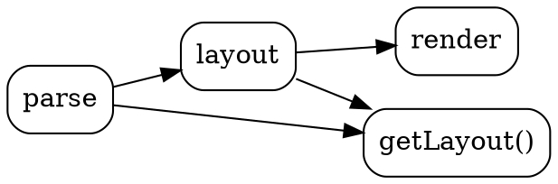
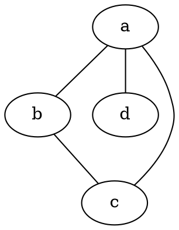
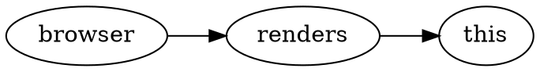
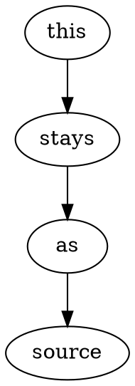

# vitepress-plugin-dot demo

Each ` ```dot ` block below is rendered to inline SVG **at build time** — view
source on this page and you'll see `<svg>`, not a `<script>` or a code block.

## A directed graph (default `dot` engine)



## A different engine per block



## Client-side render (renders in your browser, not at build time)

Add `client` to the fence info to render a block in the browser on mount instead
of at build time — useful for untrusted or interactive graphs. Requires the
`DotDiagram` component registered in your theme (see this demo's
`theme/index.ts`). (Use space-separated options, not `{...}` — VitePress reserves
curly braces in fence info.)



## Opt a block out of rendering (kept as source, still highlighted)

Add `no-render` and the plugin hands the block back to VitePress's normal fence
renderer untouched — shown as source below. It's syntax-highlighted because this
demo registers a DOT TextMate grammar via `markdown.languages` (Shiki bundles no
`dot` grammar; see `.vitepress/config.ts` and the README "Highlighting DOT
source").



## An intentional error renders a readable panel

```dot
digraph { a -> }
```
