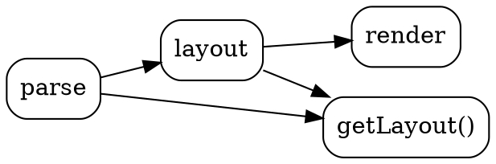
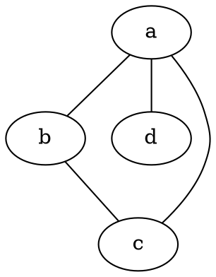
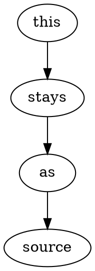

# vitepress-plugin-graphviz demo

Each ` ```dot ` block below is rendered to inline SVG **at build time** — view
source on this page and you'll see `<svg>`, not a `<script>` or a code block.

## A directed graph (default `dot` engine)



## A different engine per block



## Opt a block out of rendering (keeps it as highlighted source)



## An intentional error renders a readable panel

```dot
digraph { a -> }
```
