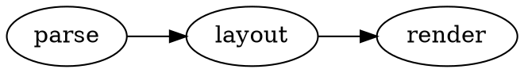

# @knowvah/docusaurus-plugin-dot

Render [Graphviz](https://graphviz.org/) **DOT** fenced code blocks as diagrams
in [Docusaurus](https://docusaurus.io/), powered by the pure-TypeScript
[@knowvah/dot-engine](https://www.npmjs.com/package/@knowvah/dot-engine) and the shared
[`@knowvah/dot-core`](../core) render engine.

A remark plugin renders ` ```dot ` blocks. **Build mode** (the default) renders
the SVG during the build and injects it into a static `<div>` via
`dangerouslySetInnerHTML` — so it ends up in the SSR'd HTML with no client JS.
**Client mode** (` ```dot client ` or `mode: 'client'`) emits a `<DotDiagram>`
React component that renders in the browser instead.

## Install

```bash
npm i -D @knowvah/docusaurus-plugin-dot @knowvah/dot-engine
```

`react` and `@knowvah/dot-engine` are peer dependencies (Docusaurus provides React).

## Usage

For **build mode** (default) you only need steps 1 and 3. **Client mode** also
needs step 2 (register the component).

**1. Add the remark plugin** in `docusaurus.config.ts`:

```ts
import remarkDot from '@knowvah/docusaurus-plugin-dot';

export default {
  presets: [
    [
      'classic',
      {
        docs: {
          remarkPlugins: [[remarkDot, { useCurrentColor: true }]],
        },
      },
    ],
  ],
};
```

**2. (Client mode only) Register the `DotDiagram` component** by swizzling `src/theme/MDXComponents`:

```tsx
// src/theme/MDXComponents.tsx
import MDXComponents from '@theme-original/MDXComponents';
import DotDiagram from '@knowvah/docusaurus-plugin-dot/client';

export default { ...MDXComponents, DotDiagram };
```

**3. Import the styles** (e.g. in `src/css/custom.css`):

```css
@import '@knowvah/docusaurus-plugin-dot/style.css';
```

Then in any doc:

````md

````

## Options

Same `DotPluginOptions` as [`@knowvah/dot-core`](../core): `renderLanguage`,
`mode` (`build` | `client`), `defaultEngine`, `wrapperClass`, `useCurrentColor`,
and `timeout` / `onError` (build mode). Per-block via the code meta:
`` ```dot engine=neato ``, `` ```dot no-render ``, `` ```dot client ``.

## Stability

As of **1.0**, this package follows [semantic versioning](https://semver.org/):
the documented public API is stable, and breaking changes will bump the major
version.

## License

MIT © Knowvah
