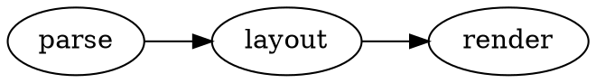

# @knowvah/docusaurus-plugin-dot

Render [Graphviz](https://graphviz.org/) **DOT** fenced code blocks as diagrams
in [Docusaurus](https://docusaurus.io/), powered by the pure-TypeScript
[graphviz-ts](https://www.npmjs.com/package/graphviz-ts) engine and the shared
[`@knowvah/dot-core`](../core) render engine.

Docusaurus renders through MDX, which parses raw HTML as JSX — and Graphviz SVG
carries non-JSX attributes — so v1 renders **client-side**: a remark plugin
rewrites ` ```dot ` blocks into a `<DotDiagram>` React component that renders in
the browser on mount. (A build-time SSR mode is a possible follow-up.)

## Install

```bash
npm i -D @knowvah/docusaurus-plugin-dot graphviz-ts
```

`react` and `graphviz-ts` are peer dependencies (Docusaurus provides React).

## Usage

Two steps — add the remark plugin, and register the component.

**1. Add the remark plugin** in `docusaurus.config.ts`:

```ts
import remarkDot from '@knowvah/docusaurus-plugin-dot';

export default {
  presets: [
    [
      'classic',
      {
        docs: {
          remarkPlugins: [[remarkDot, { useCurrentColor: true }]],
        },
      },
    ],
  ],
};
```

**2. Register the `DotDiagram` component** by swizzling `src/theme/MDXComponents`:

```tsx
// src/theme/MDXComponents.tsx
import MDXComponents from '@theme-original/MDXComponents';
import DotDiagram from '@knowvah/docusaurus-plugin-dot/client';

export default { ...MDXComponents, DotDiagram };
```

**3. Import the styles** (e.g. in `src/css/custom.css`):

```css
@import '@knowvah/docusaurus-plugin-dot/style.css';
```

Then in any doc:

````md

````

## Options

Same `DotPluginOptions` as [`@knowvah/dot-core`](../core): `renderLanguage`,
`defaultEngine`, `wrapperClass`, `useCurrentColor`. Per-block via the code meta:
`` ```dot engine=neato `` and `` ```dot no-render ``. (`timeout` / `onError`
apply to build-mode rendering and are unused in this client-mode adapter.)

## License

MIT © Knowvah
