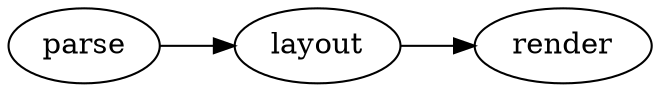

# @knowvah/eleventy-plugin-dot

Render [Graphviz](https://graphviz.org/) **DOT** fenced code blocks to inline SVG
in [Eleventy](https://www.11ty.dev/) — **at build time**, no client JS — powered
by the pure-TypeScript [graphviz-ts](https://www.npmjs.com/package/graphviz-ts)
engine and the shared [`@knowvah/dot-core`](../core) render engine.

Eleventy is a static generator, so this plugin renders diagrams during the build
and embeds static `<svg>`. It hooks Eleventy's default markdown-it engine.

## Install

```bash
npm i -D @knowvah/eleventy-plugin-dot graphviz-ts
```

Requires **Eleventy 2.0+** (uses `amendLibrary`) with its default markdown-it
engine. `graphviz-ts` is a peer dependency.

## Usage

```js
// eleventy.config.js
import eleventyPluginDot from '@knowvah/eleventy-plugin-dot';

export default function (eleventyConfig) {
  eleventyConfig.addPlugin(eleventyPluginDot, {
    // options (all optional)
    defaultEngine: 'dot',
    useCurrentColor: true,
  });
}
```

Then in any markdown file:

````md

````

Include the styles once in your layout (copy into your assets, or pipe through
your CSS build): `@knowvah/eleventy-plugin-dot/style.css`.

## Options

Same as [`@knowvah/dot-core`](../core)'s `DotPluginOptions`: `renderLanguage`,
`defaultEngine`, `wrapperClass`, `timeout` (child-process safe-mode for untrusted
DOT), `onError` (`panel` | `throw`), and `useCurrentColor` (theme-aware colors).
Per-block: `` ```dot engine=neato `` and `` ```dot no-render ``.

**Build-only for now:** `client`-mode blocks are treated as `no-render`
(delegated to normal highlighting). A client (web-component) mode may follow.

## License

MIT © Knowvah
