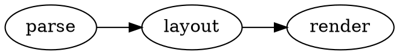
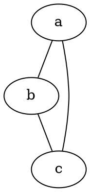
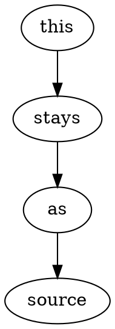

# @knowvah/eleventy-plugin-dot demo

Each ` ```dot ` block below is rendered to inline SVG **at build time** by
Eleventy — view source and you'll see `<svg>`, no client script.

## A directed graph



## A different engine per block



## Opt out (kept as source)


