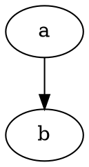

# DOT (Graphviz) Preview & Syntax — VS Code extension

Syntax highlighting and a **live SVG preview** for Graphviz **DOT** (`.dot` /
`.gv`) files, powered by the pure-TypeScript
[graphviz-ts](https://www.npmjs.com/package/graphviz-ts) engine (via
[`@knowvah/dot-core`](../core)). Rendering happens **in the extension host** —
no external Graphviz install, no `dot` binary on your PATH, no network.

## Features

- **Syntax highlighting** for `.dot` and `.gv` (a TextMate grammar for
  `source.dot`), plus comment/bracket editing behavior.
- **Live file preview** — `DOT: Open Preview to the Side` renders the active
  file to inline SVG in a webview beside the editor and re-renders as you type.
  Pick the layout engine per file with a leading line-comment directive, e.g.
  `// engine: neato` (see below); the panel title shows the active engine.
- **Markdown preview** — ` ```dot ` fenced code blocks render as inline SVG in
  VS Code's built-in Markdown preview (build-time, no client scripts). Per-block
  directives work: ` ```dot engine=neato `, ` ```dot no-render ` (leave as a
  highlighted code block).
- **Theme-aware** — diagrams inherit the editor's foreground color (black
  strokes/text are remapped to `currentColor`), so they read correctly in light
  and dark themes.

## Usage

Open a `.dot` or `.gv` file and either:

- click the **Open Preview to the Side** button in the editor title bar, or
- run **DOT: Open Preview to the Side** from the Command Palette, or
- press `Ctrl+K V` (`Cmd+K V` on macOS).

### Choosing a layout engine per file

Add a directive to a **leading line comment** (before the graph), using either
DOT line-comment style:



`# engine = fdp` works too; the match is case-insensitive. Recognized engines:
`dot` (default), `neato`, `fdp`, `sfdp`, `circo`, `twopi`, `osage`, `patchwork`.
An unrecognized or absent directive falls back to `dot`. The directive must
appear before the graph body — comments after it are ignored — and the preview
panel title shows the engine in use (e.g. `Preview graph.dot (neato)`).

## Building from source

This package lives in the [`dot-plugins`](../..) pnpm workspace.

```bash
pnpm install
pnpm --filter dot-vscode build       # esbuild → dist/extension.js (bundled)
pnpm --filter dot-vscode typecheck
pnpm --filter dot-vscode test         # vitest — preview render unit tests
pnpm --filter dot-vscode package      # vsce → dot-vscode-<version>.vsix
```

`build` bundles the extension host with esbuild, inlining `@knowvah/dot-core`
and `graphviz-ts` into a single CJS file, so the packaged `.vsix` ships with no
`node_modules`. To debug, open this folder in VS Code and press **F5** (Run
Extension) after a `build`.

## Architecture

The render logic is a pure, `vscode`-free module (`src/preview.ts`): DOT string
→ complete webview HTML (inline SVG or an error panel), which makes it unit
testable in isolation. `src/extension.ts` is the thin imperative shell — it owns
the command, the webview panel, and document-change syncing. Grammar and
language association are declarative (`package.json` `contributes`).

## Known limitations (v1)

- **Synchronous, in-process render.** A pathological non-terminating graph could
  hang the extension host until the window is reloaded. graphviz-ts's own
  documented infinite-loop cases are rare; a future version can move rendering
  to a terminable worker with a timeout.
- **HTML labels in the Markdown preview.** VS Code's built-in Markdown preview
  sanitizes rendered HTML (DOMPurify). Standard SVG shapes and text render, but
  `<foreignObject>` — which Graphviz emits for HTML-like labels
  (`label=<<table>…>>`) — is stripped by the sanitizer, so those labels won't
  show *in the Markdown preview*. Plain (string-label) graphs are unaffected,
  and the standalone **file preview** renders HTML labels correctly (it's the
  extension's own webview, not subject to the Markdown preview sanitizer).

## Licensing

The extension code is **MIT** (see [LICENSE](LICENSE)). One bundled asset —
`syntaxes/dot.tmLanguage.json` (the `source.dot` TextMate grammar) — is reused
from graphviz-ts and is licensed **EPL-2.0**; it retains that license rather
than MIT. Both licenses permit redistribution; the marketplace listing notes
this rather than claiming a blanket MIT license.
